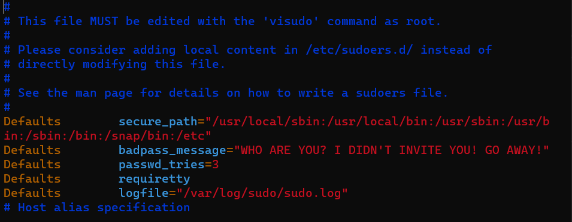
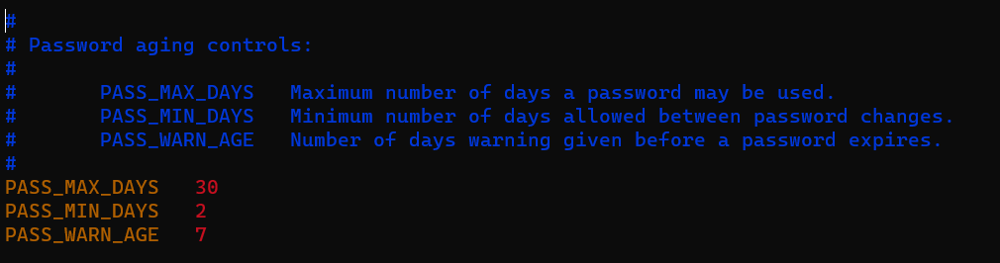
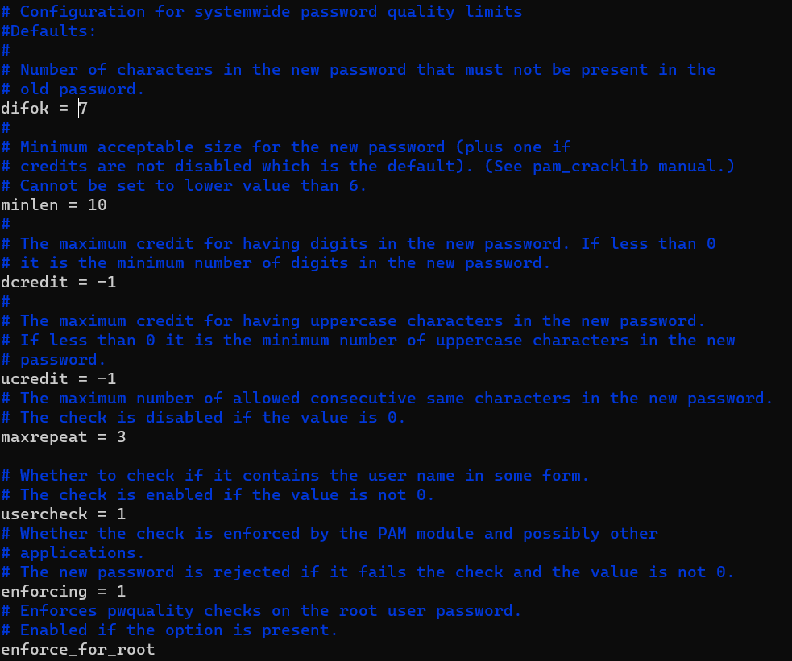
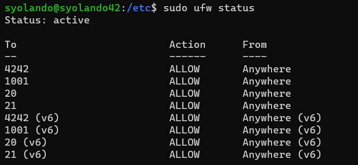
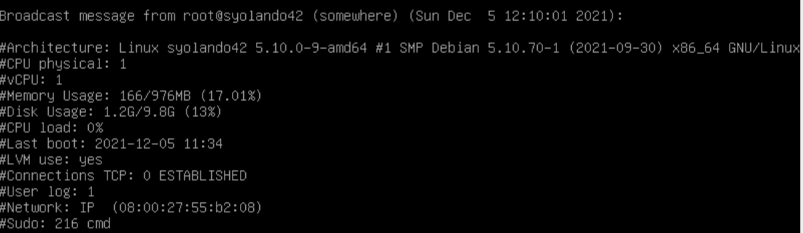
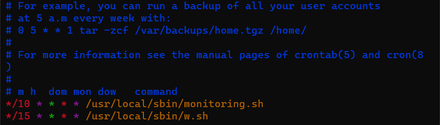
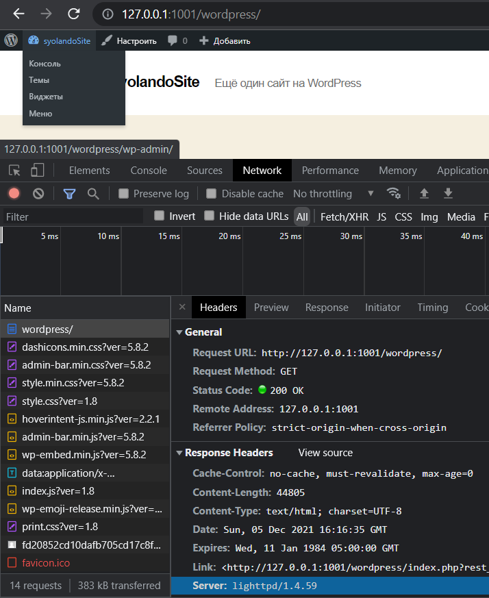
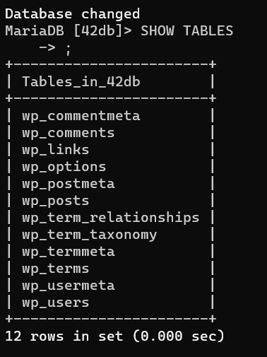
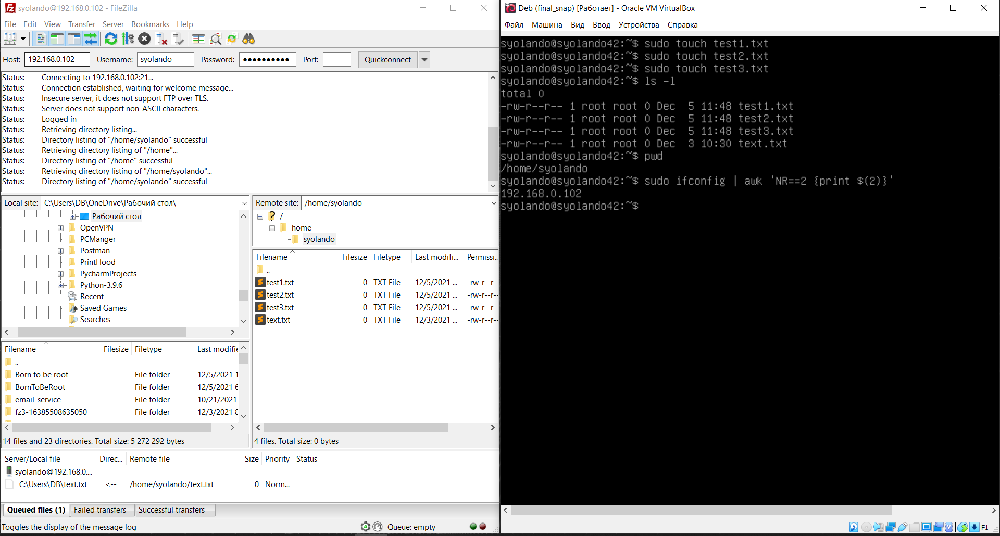

# BornToBeRoot
Setting up Debian (lighttpd, MariaDB, Wordpress, ftp, lvm, ssh, ufw, sudo, pwquality, shell scripts, cron)

*MANDATORY PART OF THE PROJECT (BornToBeRoot_task.pdf)*

1. *SSH task*: 
	In task for the project instead of default SSH port ("22") we need to set "4242" port. Also we need to restrict connection by SSH as "root" user.
	1. In "/etc/ssh/sshd_config":
		- Port 22
		- PermitRootLogin no
	2. go to VirtualBox, open network settings for VM and add port 4242 in "Port forwading".
	3. to connect via SSH to the VM use "ssh "username"@"ip_address" -p 4242". (I used NAT so for me it was like "syolando@localhost -p 4242")
	
	

2.  *SUDO task*: install sudo, limit wrong password tries, make own badpass message, log every command with "sudo", restict paths for sudo commands. 
	1. apt install sydo
	2. In "/etc/sudoers":

3.	*Password quality task*: it has to expire every 30 days, the minimal interval between passwd modification = 2 days, users shoud recieve a warinig message 7 days before their password expires. Minlen of passwd = 10, It must contain an uppercase letter and a number.  Also, it must not contain more than 3 consecutive identical characters. The password must not include the name of the user. The password must have at least 7 characters that are not part of the former password.
	1. apt install libpam-pwquality
	2. In "/etc/login.defs"

	3. In "/etc/security/pwquality.conf"
		- minlen=10
		- ucredit = -1 (at least 1 uppercase char)
		- dcredit = -1 (at least 1 digit)
		- maxrepeat = 3 (max 3 same consecutive chars)
		- usercheck = 1 (username in password is not allowed)
		- difor = 7 (num chars that are not from old password)
		- enforcing = 1 (deny weak passwords. If it is 0 - theres only warning message)

4. *UFW firewall task*: install and enable ufw. Allow only those ports that are used by your programs. 
	1. apt install ufw
	2. ufw enable
	3. ufw default deny incoming
	4. ufw default allow outgoing
	5. ufw allow "port". (lighttpd - 1001, ssh - 4242, ftp - 20, 21. Also add these ports in "Port forwading"). 

5. *Monitoring script*: Script shoud display some information on all terminals. Information contains: OS and its  kernel version, number of physical and virtual proc, current available RAM, current available disk space, proc load, date and time of last reboot, LVM status, number of active connections, number of users using the server, IPv4 and MAC, number of commands executed with sudo.
	*look at monitoring.sh*

6. *Make monitoring scripts running each 10 minutes*
	1. apt install crontab
	2. crontab -e -> add "*/10 * * * *  /usr/local/sbin/monitoring.sh"

**BONUS PART OF THE PROJECT**
7. *Set up a functional WordPress website with the following services: lighttpd, MariaDB, and PHP.*
	1. apt install lighttpd
		- sudo systemctl stop lighttpd.service
		- sudo systemctl start lighttpd.service
		- sudo systemctl enable lighttpd.service
	2. apt install mariadb-server mariadb-client
		- sudo systemctl stop mysql.service
		- sudo systemctl start mysql.service
		- sudo systemctl enable mysql.service
		- sudo mysql_secure_installation
		- Set root password? [Y/n]: 		Y
		- Remove anonymous users? [Y/n]: 		Y
		- Disallow root login remotely? [Y/n]: 	Y
		- Remove test database and access to it? [Y/n]:  	Y
		- Reload privilege tables now? [Y/n]:  	Y
		- sudo systemctl restart mysql.service
	3. apt install php
		- sudo apt install php-cgi php-cli php-mysql php-gd php-imagick php-tidy php-xml php-xmlrpc
		- sudo sudo lighttpd-enable-mod fastcgi 
		- sudo lighttpd-enable-mod fastcgi-php
		- sudo apt install libterm-readline-gnu-perl
		- sudo apt-get update && sudo apt-get upgrade 
		- sudo /etc/init.d/lighttpd force-reload
	4. Creating DB for WordPress
		- sudo mysql -u root -p
		- CREATE DATABASE "db_name";
		- CREATE USER 'username'@'localhost' IDENTIFIED BY 'password';
		- GRANT ALL ON db_name.* TO 'username'@'localhost' IDENTIFIED BY 'password' WITH GRANT OPTION;
		- FLUSH PRIVILEGES;
		- EXIT;
	5. Configure Lighttpd PHP-FastCGI Settings
		- In "/etc/php/7.4/cgi/php.ini" set "cgi.fix_pathinfo=1" (It wasn't work with '0' value)
		- In "/etc/lighttpd/lighttpd.conf" add "mod_rewrite" in "server.modules", set needed port (1001 for me). Also add:
			$HTTP["host"] =~ "address_your site" {
    		server.document-root = "/var/www/html/wordpress"
    		server.errorlog      = "/var/log/lighttpd/example.com-error.log"
    		server.error-handler-404 = "/index.php"
			}
		- In "/etc/lighttpd/conf-available/15-fastcgi-php.conf" modify "bin-path" like /usr/bin/php-cgi7.4(put here your php-cgi version)"
	6. Downloading WordPress, moving to relevant path and changing permissions and owner.
		- cd /tmp && wget https://wordpress.org/latest.tar.gz
		- tar -zxvf latest.tar.gz
		- sudo mv wordpress /var/www/html/wordpress
		- sudo chown -R www-data:www-data /var/www/html/wordpress/
		- sudo chmod -R 755 /var/www/html/wordpress/
	7. Configuring WordPress
		- sudo mv /var/www/html/wordpress/wp-config-sample.php /var/www/html/wordpress/wp-config.php
		- In "/var/www/html/wordpress/wp-config.php" set "DB_NAME", "DB_USER", "DB_PASSWORD" according to the 4th step "Creating DB for WordPress" above.
		- sudo systemctl restart lighttpd.service
	8. Enable PHP for Lighttpd
		- sudo lighty-enable-mod fastcgi
		- sudo lighty-enable-mod fastcgi-php
	9. Go to browser on your home OS and go to "localhost:1001". Configure WP.
	10. To prove that you are using Lighttpd server and WordPress -> right click on "127.0.0.1:1001/wordpress" -> Inspect -> Network -> Ctnrl + Shift + R -> left click on "wordpress/" In 'Name' column -> Headers -> Response Headers -> Server. And there is obviously "lighttpd/....(version)..."

8. *Set up a service of your choice that you think is useful (NGINX / Apache2 excluded!). During the defense, you will have to justify your choice*. | I decided to set up FTP service.
	1. apt install vsftpd
	2. systemctl start vsftpd 
	3. systemctl enable vsftpd
	4. ufw allow 20
	5. ufw allow 21
	6. In "/etc/vsftpd.conf"
		- write_enable=YES
		- anonymous_enable=NO
	7. Because of I used NAT, I had problems to connet via ftp to VM. So I changed Net Configuration to "Bridge", rebooted VM. With "sudo ifconfig" I found IPv4 address.
	8. I installed ftp сlient "FileZilla Client".
	9. Enter ip, username, password and port (21) of your VM and enjoy.
	10. Possibly you need to switch to "Active mode" FTP.

